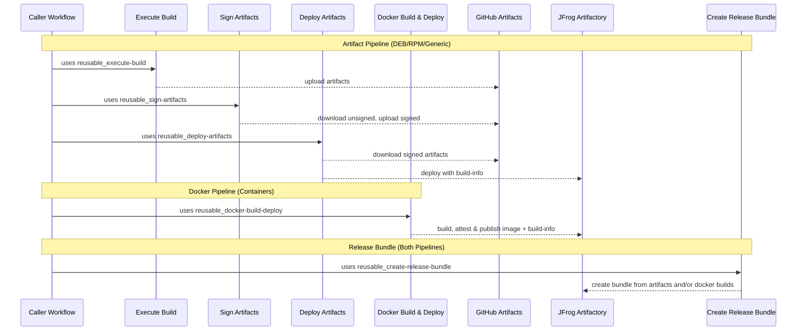

# Shared Workflows – Composable CI/CD

> If the standard orchestrated workflows fit your needs, see [CICD-standard.md](CICD-standard.md) for the simpler approach. This guide covers the composable path, where you call the lower-level workflows directly and wire the stages together yourself.

---

## When to use composable workflows

The orchestrated `reusable_artifacts-cicd.yaml` handles build → sign → deploy as a single call. The composable approach gives you the same building blocks but wired together in your own workflow, so you can insert custom steps between stages, run parallel deploys to multiple targets, or otherwise shape the pipeline to your needs:

| Workflow                         | Purpose                                                                                |
| -------------------------------- | -------------------------------------------------------------------------------------- |
| `reusable_execute-build.yaml`    | Run a build script, upload artifacts to GitHub Artifacts, publish build-info to JFrog  |
| `reusable_sign-artifacts.yaml`   | Download unsigned artifacts, GPG-sign deb/rpm/generic files, SSL.com-sign nupkg files  |
| `reusable_deploy-artifacts.yaml` | Download signed artifacts, upload to JFrog Artifactory (auto-routes by file extension) |

## High-level flow



Internally, GitHub Actions artifacts are used for _in-runner handoff_ between stages; JFrog deployments are used for _durable discovery and consumption_ beyond the workflow.

---

## Composable artifact pipeline example

See [example_composable-matrix.yaml](https://github.com/aerospike/shared-workflows/blob/main/.github/workflows/example_composable-matrix.yaml) for a complete working example. It demonstrates a matrix build across multiple distros with a custom test step inserted between build and sign:

```text
extract-version  →  build (matrix)  →  collect  →  [your tests here]  →  sign  →  deploy
```

Key things to note when composing manually:

- **`jf-build-id`** must be the same in the build and deploy jobs; it ties the build-info together. Use `${{ github.run_id }}-${{ github.run_attempt }}` as the base, which is unique per run and safe for re-runs. In matrix builds, each per-matrix job should use a distinct suffix (e.g., `${{ github.run_id }}-${{ github.run_attempt }}-buildinfo-${{ matrix.distro }}-${{ matrix.arch }}`), and the parent deploy job uses the base without the per-matrix suffix.
- **`jf-metadata-build-id`** is the prefix used to discover per-matrix child build-infos for aggregation (e.g., `${{ github.run_id }}-${{ github.run_attempt }}-buildinfo`). It is optional; when omitted, aggregation is skipped and only the parent build-info is published.
- **`gh-artifact-name`** / **`gh-unsigned-artifacts`** must match between stages; this is how artifacts flow via GitHub Artifacts.
- **Matrix builds** require a collect step to merge per-matrix artifacts into a single artifact before sign and deploy can consume them. See the example for the inline download + upload pattern.
- **Signing secrets** (GPG keys, and SSL.com credentials if nupkg files are present) must be available via `secrets: inherit`.
- **Java/Maven setup:** Pass `setup-java: true` to `reusable_execute-build.yaml` along with optional `java-version` (default `"21"`), `java-distribution` (default `temurin`), and `java-cache` (default `maven`).
- **JAR artifacts:** Pass `jar-group-id` to `reusable_deploy-artifacts.yaml` as a Maven group ID fallback when JAR metadata doesn't include one.

### Build-info architecture

The pipeline produces three kinds of JFrog build-info records that form a parent-child tree. Understanding this structure is important when wiring the composable workflows, since you are responsible for passing consistent build IDs between stages.

Each pipeline run produces:

```text
my-app / 1234567-1                                (parent)
├── my-app / 1234567-1-buildinfo-el9-x86_64        (metadata child)
├── my-app / 1234567-1-buildinfo-jammy-x86_64      (metadata child)
└── my-app / 1234567-1-artifacts                    (artifact child)
```

The suffixes after `buildinfo-` are yours to choose. Use whatever uniquely identifies the build variant: `-{distro}-{arch}` for OS matrix builds, `-npm` or `-java` for ecosystem-specific builds, etc. The only requirement is that all metadata children share the `jf-metadata-build-id` prefix so the deploy stage can discover them via AQL.

**Metadata children** (produced by `reusable_execute-build.yaml`). One per build job (matrix variant or standalone). Each build worker publishes a build-info containing CI environment variables and git commit/branch but no artifact references, because artifacts are uploaded later by a different job on a different runner.

**The artifact child** (produced by `reusable_deploy-artifacts.yaml`). Created during deployment when artifacts are uploaded to JFrog. Each `jf rt upload` call tags the artifact with this build number (`{jf-build-id}-artifacts`), so JFrog knows which files belong to this build.

**The parent** (produced by `reusable_deploy-artifacts.yaml`). At the end of deployment, the deploy entrypoint discovers all metadata children via an AQL query using the `jf-metadata-build-id` prefix, appends them and the artifact child via `jf rt build-append`, then publishes the parent. This is the single record that ties everything together: these artifacts, from these environments, at this commit.

Release bundles reference the parent build-info by `name:version`, providing a complete chain of custody from source to distributable.

#### How the IDs connect

| Input                        | Value                                       | Used by                                       |
| ---------------------------- | ------------------------------------------- | --------------------------------------------- |
| `jf-build-id` (build stage)  | `{run}-{attempt}-buildinfo-{unique-suffix}` | Metadata child build number                   |
| `jf-build-id` (deploy stage) | `{run}-{attempt}`                           | Parent build number                           |
| `jf-metadata-build-id`       | `{run}-{attempt}-buildinfo`                 | Prefix for AQL discovery of metadata children |
| _(derived internally)_       | `{jf-build-id}-artifacts`                   | Artifact child build number                   |

The deploy stage uses `jf-metadata-build-id` as a search prefix to find all metadata children published during the build stage. This is why per-matrix build IDs must start with the metadata prefix and add a unique suffix (typically `-{distro}-{arch}`).

## Full composable example with docker and release bundle

```yaml
jobs:
  # Artifact pipeline: build → sign → deploy (manual composition)
  build:
    uses: aerospike/shared-workflows/.github/workflows/reusable_execute-build.yaml@v3.2.0
    with:
      gh-workflows-ref: v3.2.0
      jf-project: my-project
      jf-build-name: my-app
      jf-build-id: ${{ github.run_id }}-${{ github.run_attempt }}-buildinfo
      gh-artifact-directory: dist
      build-script: |
        make build
      # Optional: Java/Maven setup
      # setup-java: true
      # java-version: "17"
    secrets: inherit

  sign:
    needs: [build]
    uses: aerospike/shared-workflows/.github/workflows/reusable_sign-artifacts.yaml@v3.2.0
    with:
      gh-workflows-ref: v3.2.0
    secrets: inherit

  deploy:
    needs: [sign]
    uses: aerospike/shared-workflows/.github/workflows/reusable_deploy-artifacts.yaml@v3.2.0
    with:
      gh-workflows-ref: v3.2.0
      jf-project: my-project
      jf-build-name: my-app
      jf-build-id: ${{ github.run_id }}-${{ github.run_attempt }}
      jf-metadata-build-id: ${{ github.run_id }}-${{ github.run_attempt }}-buildinfo
      version: 1.2.3
      # Optional: Maven group ID fallback for JAR artifacts
      # jar-group-id: com.aerospike
    secrets: inherit

  # Docker pipeline: build with attestations → deploy
  docker:
    uses: aerospike/shared-workflows/.github/workflows/reusable_docker-build-deploy.yaml@v3.2.0
    with:
      attest: true
      sbom: true
      # ... docker config ...

  # Unified release: bundle all builds together
  release-bundle:
    needs: [deploy, docker]
    uses: aerospike/shared-workflows/.github/workflows/reusable_create-release-bundle.yaml@v3.2.0
    with:
      gh-workflows-ref: v3.2.0
      jf-build-names: "my-app:1.2.3,my-app-container:1.2.3"
```

For a complete working example that combines artifacts and docker pipelines see [example_reusable-integration.yaml](https://github.com/aerospike/shared-workflows/blob/main/.github/workflows/example_reusable-integration.yaml).

---

## Why gh-workflows-ref is required

All shared workflows require the `gh-workflows-ref` input, which **should match** the version in your `uses:` line:

```yaml
jobs:
  build:
    uses: aerospike/shared-workflows/.github/workflows/reusable_execute-build.yaml@v3.2.0
    with:
      gh-workflows-ref: v3.2.0 # Should match @v3.2.0 above
      # ... other inputs ...
```

### The problem

GitHub Actions has a fundamental limitation: **reusable workflows cannot access their own ref**. When you call `uses: org/repo/.github/workflows/workflow.yaml@v3.2.0`, the workflow itself has no way to know it was called with `@v3.2.0`.

The available context variables don't help:

- `github.sha` → SHA of the _caller's_ commit, not shared-workflows
- `github.workflow_sha` → SHA of the _caller's_ workflow file, not the reusable one
- `github.ref` → ref of the _caller's_ repository

There is no `github.called_workflow_ref` or similar.

### Why this matters

These workflows need to checkout their own repository to access entrypoint scripts (bash scripts that do the actual work). Without knowing which version was called, they can't checkout the matching scripts which leads to a version mismatch where the workflow is v3.2.0 but the scripts are from a different version.

### Known issue

This is a long-standing GitHub Actions limitation with no native solution:

- [actions/runner#2417](https://github.com/actions/runner/issues/2417)
- [community/discussions#38659](https://github.com/orgs/community/discussions/38659)

Third-party workarounds exist but don't pass security review. Until GitHub adds native support, `gh-workflows-ref` is the reliable solution.

---

## Troubleshooting tips

- **Deploy fails (auth)** → confirm GitHub→JFrog **OIDC** trust/policy is configured and that the workflow's identity has deploy permission to the target project/repo. (example mistakes often around wrong audience or incorrect token permissions)
- **Docker push fails** → ensure `tag` includes the full registry path (e.g., `artifact.aerospike.io/project-docker-dev-local/image:tag`). Verify JFrog registry permissions and OIDC authentication.
- **Bundle creation issues** → confirm the `jf-build-names` input is a comma-separated list of `name:version` pairs that exist for the specified build, and that your JFrog project/repo permissions allow bundle creation. This permission is higher than upload/download so often a source of error.

---
