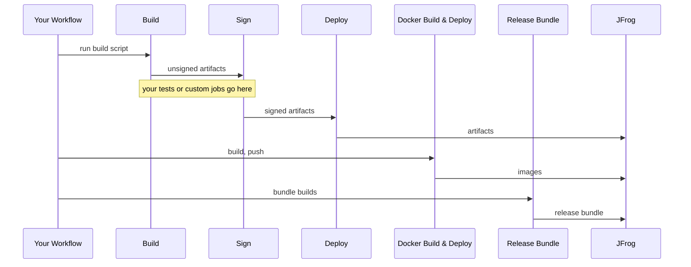

# Shared Workflows -- Composable CI/CD

> If the standard orchestrated workflows fit your needs, see [CICD-standard.md](https://github.com/aerospike/shared-workflows/blob/main/.github/workflows/docs/CICD-standard.md) for the simpler approach. This guide covers the composable path, where you call the lower-level workflows directly and wire the stages together yourself.

---

## When to use composable workflows

The orchestrated `reusable_artifacts-cicd.yaml` handles build → sign → deploy as a single call. The composable approach gives you the same building blocks but wired together in your own workflow, so you can insert custom steps between stages, run parallel deploys to multiple targets, or otherwise shape the pipeline to your needs.

### Reusable workflows

| Workflow                              | Purpose                                                                                      |
| ------------------------------------- | -------------------------------------------------------------------------------------------- |
| `reusable_execute-build.yaml`         | Run a build script, upload artifacts to GitHub Artifacts, publish build-info to JFrog        |
| `reusable_sign-mac-artifacts.yaml`    | Apple codesign/productsign/notarize for .pkg, .dmg, Mach-O binaries (macOS runner)           |
| `reusable_sign-win-artifacts.yaml`    | Authenticode signing for .exe, .msi, .msix via SSL.com eSigner CodeSignTool (Windows runner) |
| `reusable_sign-artifacts.yaml`        | Download unsigned artifacts, GPG-sign deb/rpm/generic files, SSL.com-sign nupkg files        |
| `reusable_deploy-artifacts.yaml`      | Download signed artifacts, upload to JFrog Artifactory (auto-routes by file extension)       |
| `reusable_create-release-bundle.yaml` | Create JFrog release bundle from one or more builds (standalone, handles checkout and setup) |

### Composite actions

| Action                    | Purpose                                                                      |
| ------------------------- | ---------------------------------------------------------------------------- |
| `collect-build-artifacts` | Merge per-matrix GitHub Artifacts into a single artifact for downstream jobs |
| `create-release-bundle`   | Create a JFrog release bundle from one or more builds                        |
| `delete-release-bundle`   | Delete an existing release bundle version (safe no-op if it doesn't exist)   |
| `promote-release-bundle`  | Promote a release bundle to a target promotion stage (DEV, TEST, PROD, etc.) |

## High-level flow



Internally, GitHub Actions artifacts are used for _in-runner handoff_ between stages; JFrog deployments are used for _durable discovery and consumption_ beyond the workflow.

---

## Composable artifact pipeline

See [example_composable-matrix.yaml](https://github.com/aerospike/shared-workflows/blob/main/.github/workflows/example_composable-matrix.yaml) for the complete working example. It demonstrates DEB/RPM, npm, Java/Maven, Python/PyPI, Go module, and Helm chart builds with a custom test step inserted between build and sign:

```text
extract-version  →  build (matrix + npm + java + python + go + helm)  →  collect  →  [your tests]  →  sign-mac (optional)  →  sign-windows (optional)  →  sign  →  deploy
```

With release bundles (shown in the example for `workflow_dispatch`):

```text
deploy  →  create-release-bundle  →  promote
```

When you use `reusable_deploy-artifacts.yaml` followed by `reusable_create-release-bundle.yaml`, pass `gh-bundle-metadata-artifact-name: ${{ needs.<deploy-job>.outputs.bundle-metadata-artifact-name }}` so Maven bundle metadata (`.maven-bundle-metadata.json`) is carried between jobs as a small artifact; the deploy workflow sets `bundle-metadata-available` when that upload ran.

**Permissions:** caller workflows need `contents: read` and `id-token: write`. When using Maven bundle metadata upload (`gh-upload-bundle-metadata`, default `true`), also grant `actions: write` on the top-level workflow or job. When passing `gh-bundle-metadata-artifact-name` to create-release-bundle, also grant `actions: read`. Set `gh-upload-bundle-metadata: false` on deploy if you do not need the metadata artifact and cannot grant `actions: write`.

### Key concepts

**Build IDs.** The `jf-build-id` ties build-info together across stages. Use `${{ github.run_id }}-${{ github.run_attempt }}` as the base. Each build job adds a unique suffix; the deploy job uses the base without the suffix.

```text
Per-matrix build:  {run_id}-{run_attempt}-buildinfo-{distro}-{arch}
Ecosystem build:   {run_id}-{run_attempt}-buildinfo-{ecosystem}-x86_64
Metadata prefix:   {run_id}-{run_attempt}-buildinfo
Deploy parent:     {run_id}-{run_attempt}
```

**Artifact naming.** Each build job uploads with a distinct name (e.g., `build-artifacts-el9-x86_64`, `build-artifacts-npm-x86_64`). The `collect-build-artifacts` action merges these into a single `build-artifacts` artifact that sign and deploy consume.

**Collecting matrix artifacts.** Use the `collect-build-artifacts` composite action after all build jobs complete. It downloads all artifacts matching a pattern (default `build-artifacts-*`) with **`merge-multiple: false`** (each artifact isolated), runs `merge_flat.sh` to copy files **sequentially** into one flat directory (avoids corrupting binaries when the same basename is unpacked concurrently), **fails fast** if two files would share the same basename, then re-uploads as one merged artifact.

**Why not `merge-multiple: true`?** Flat-merging multiple artifact zips into one directory can interleave or partially overwrite the same path under load, producing damaged archives (for example ZIP CRC errors inside wheels). Isolated download plus sequential copy prevents that class of failure.

**Signing secrets.** GPG keys (and SSL.com credentials if nupkg files or Windows executables are present) must be available. For Mac signing, provide Apple certificates and notarization credentials; for Windows signing, provide SSL.com eSigner credentials. See the [sign-mac-artifacts README](https://github.com/aerospike/shared-workflows/blob/main/.github/workflows/sign-mac-artifacts/README.md) and [sign-win-artifacts README](https://github.com/aerospike/shared-workflows/blob/main/.github/workflows/sign-win-artifacts/README.md).

**Mac signing (optional).** If your build produces macOS artifacts, insert `reusable_sign-mac-artifacts.yaml` between collect and GPG sign. It downloads `build-artifacts`, Apple-signs the matched files, and re-uploads with `overwrite: true`. The GPG sign step then picks up the already-Apple-signed artifacts:

```yaml
sign-mac:
  needs: collect
  uses: aerospike/shared-workflows/.github/workflows/reusable_sign-mac-artifacts.yaml@v3.2.0
  with:
    gh-unsigned-artifacts: build-artifacts
    gh-workflows-ref: v3.2.0
    signing-identity: "Developer ID Application: Aerospike, Inc. (22224RFU67)"
    installer-identity: "Developer ID Installer: Aerospike, Inc. (22224RFU67)"
    artifact-glob: "*.pkg"
  secrets:
    apple-application-cert: ${{ secrets.APPLE_APPLICATION_CERT }}
    apple-id: ${{ secrets.APPLE_ID }}
    apple-installer-cert: ${{ secrets.APPLE_INSTALLER_CERT }}
    apple-cert-password: ${{ secrets.APPLE_CERT_PASSWORD }}
    apple-notarization-password: ${{ secrets.APPLE_NOTARIZATION_PASSWORD }}
    apple-team-id: ${{ secrets.APPLE_TEAM_ID }}

sign:
  needs: [collect, sign-mac]
  if: always() && !cancelled() && !failure()
  uses: aerospike/shared-workflows/.github/workflows/reusable_sign-artifacts.yaml@v3.2.0
  with:
    gh-unsigned-artifacts: build-artifacts
    gh-workflows-ref: v3.2.0
  secrets: inherit
```

The `if: always() && !cancelled() && !failure()` on the GPG sign job ensures it runs even when `sign-mac` is skipped (a skipped needed job would otherwise silently skip the downstream job too).

**Windows signing (optional).** If your build produces Windows executables (.exe, .msi, .msix), insert `reusable_sign-win-artifacts.yaml` between collect and GPG sign. It downloads `build-artifacts`, Authenticode-signs the matched files via SSL.com CodeSignTool, and re-uploads with `overwrite: true`. The GPG sign step then picks up the already-signed executables. Place it after `sign-mac` so the GPG `sign` job needs both:

```yaml
sign-windows:
  needs: collect
  uses: aerospike/shared-workflows/.github/workflows/reusable_sign-win-artifacts.yaml@v3.2.0
  with:
    gh-unsigned-artifacts: build-artifacts
    gh-workflows-ref: v3.2.0
    runs-on: windows-2025
    artifact-glob: "*.exe,*.msi,*.msix"
    signing-identity: "My Product Inc." # Optional display name
  secrets:
    es_ov_username: ${{ secrets.ES_OV_USERNAME }}
    es_ov_password: ${{ secrets.ES_OV_PASSWORD }}
    es_ov_credential_id: ${{ secrets.ES_OV_CREDENTIAL_ID }}
    es_ov_totp_secret: ${{ secrets.ES_OV_TOTP_SECRET }}

sign:
  needs: [collect, sign-mac, sign-windows]
  if: always() && !cancelled() && !failure()
  uses: aerospike/shared-workflows/.github/workflows/reusable_sign-artifacts.yaml@v3.2.0
  with:
    gh-unsigned-artifacts: build-artifacts
    gh-workflows-ref: v3.2.0
  secrets: inherit
```

See [example_win-signing.yaml](https://github.com/aerospike/shared-workflows/blob/main/.github/workflows/example_win-signing.yaml) for a full Windows-signing pipeline.

**Language and tool setup.** Pass `setup-java: true` to `reusable_execute-build.yaml` along with optional `java-version` (default `"21"`), `java-distribution` (default `temurin`), and `java-cache` (default `maven`). The same workflow also exposes `setup-dotnet` (with `dotnet-version`, default `8.0`), `setup-python` (with `python-version`, default `3.12`), and `setup-helm` (with `helm-version`, default `latest`) to install the matching toolchain before your build script runs. For JAR artifacts, pass `jar-group-id` to `reusable_deploy-artifacts.yaml` as a Maven group ID fallback when JAR metadata doesn't include one.

**Build environment.** `reusable_execute-build.yaml` accepts a `build-env` input: semicolon-delimited `KEY=VALUE` pairs exported into the build script's environment (use `\;` for a literal semicolon and `\\` for a literal backslash; parsed by `execute-build/parse-build-env.sh`). When both a top-level `build-env` and a matrix-level `build-env` are present, they are **merged** by concatenation (`{top-level};{matrix-level}`) with the matrix entry appended last, so matrix keys win on duplicates. It is not a replace. See [INFRA-482](https://aerospike.atlassian.net/browse/INFRA-482).

**Matrix data (`MATRIX_JSON`).** `reusable_execute-build.yaml` also accepts a separate `matrix-json-data` input, exported to the build subprocess as the `MATRIX_JSON` environment variable (the jq-parseable JSON of the current matrix entry). This lets a build script branch on matrix properties (distro, arch, custom flags). `MATRIX_JSON` is a distinct input from `build-env` precisely so embedded semicolons in the JSON do not corrupt the `build-env` split (INFRA-482).

### Build-info architecture

The pipeline produces three kinds of JFrog build-info records that form a parent-child tree. You are responsible for passing consistent build IDs between stages.

Each pipeline run produces:

```text
my-app / 1234567-1                                (parent)
├── my-app / 1234567-1-buildinfo-el9-x86_64        (metadata child)
├── my-app / 1234567-1-buildinfo-npm-x86_64         (metadata child)
├── my-app / 1234567-1-buildinfo-java-x86_64        (metadata child)
├── my-app / 1234567-1-buildinfo-python-x86_64      (metadata child)
├── my-app / 1234567-1-buildinfo-go-x86_64          (metadata child)
└── my-app / 1234567-1-artifacts                    (artifact child)
```

The suffixes after `buildinfo-` are yours to choose. Use whatever uniquely identifies the build variant: `-{distro}-{arch}` for OS matrix builds, `-npm-x86_64` or `-java-x86_64` for ecosystem-specific builds, etc. The only requirement is that all metadata children share the `jf-metadata-build-id` prefix so the deploy stage can discover them via AQL.

**Metadata children** (produced by `reusable_execute-build.yaml`). One per build job. Each publishes a build-info containing CI environment variables and git commit/branch but no artifact references, because artifacts are uploaded later by a different job on a different runner.

**The artifact child** (produced by `reusable_deploy-artifacts.yaml`). Created during deployment when artifacts are uploaded to JFrog. Each `jf rt upload` call tags the artifact with this build number (`{jf-build-id}-artifacts`), so JFrog knows which files belong to this build.

**The parent** (produced by `reusable_deploy-artifacts.yaml`). At the end of deployment, the deploy entrypoint discovers all metadata children via an AQL query using the `jf-metadata-build-id` prefix, appends them and the artifact child via `jf rt build-append`, then publishes the parent. This is the single record that ties everything together.

Release bundles reference the parent build-info by `name:version`, providing a complete chain of custody from source to distributable.

#### How the IDs connect

| Input                        | Value                                       | Used by                                       |
| ---------------------------- | ------------------------------------------- | --------------------------------------------- |
| `jf-build-id` (build stage)  | `{run}-{attempt}-buildinfo-{unique-suffix}` | Metadata child build number                   |
| `jf-build-id` (deploy stage) | `{run}-{attempt}`                           | Parent build number                           |
| `jf-metadata-build-id`       | `{run}-{attempt}-buildinfo`                 | Prefix for AQL discovery of metadata children |
| _(derived internally)_       | `{jf-build-id}-artifacts`                   | Artifact child build number                   |

The deploy stage uses `jf-metadata-build-id` as a search prefix to find all metadata children published during the build stage. This is why per-matrix build IDs must start with the metadata prefix and add a unique suffix.

### Release bundle lifecycle

At Aerospike, release bundles are the only way artifacts are promoted between environments. See [Release Bundles](https://github.com/aerospike/shared-workflows/blob/main/.github/workflows/docs/release-bundles.md) for the full guide covering the promotion pipeline, usage, and troubleshooting.

## Full examples

- [example_composable-matrix.yaml](https://github.com/aerospike/shared-workflows/blob/main/.github/workflows/example_composable-matrix.yaml): multi-ecosystem matrix builds (DEB/RPM, npm, Java, Python, Go, Helm) with custom test step, release bundle lifecycle, and promotion
- [example_win-signing.yaml](https://github.com/aerospike/shared-workflows/blob/main/.github/workflows/example_win-signing.yaml): Windows Authenticode signing wired into a composable pipeline
- [example_expanded-integration.yaml](https://github.com/aerospike/shared-workflows/blob/main/.github/workflows/example_expanded-integration.yaml): exhaustive composable showcase with custom packaging and downstream artifact consumption

---

See [Why gh-workflows-ref is required](https://github.com/aerospike/shared-workflows/blob/main/.github/workflows/docs/why-gh-workflows-ref.md) for details on this GitHub Actions limitation.

---

## Troubleshooting tips

- **Workflow validation: "requesting 'actions: write', but is only allowed 'actions: none'"** → add `actions: write` to your caller `permissions` when using Maven bundle metadata upload (`gh-upload-bundle-metadata`, default `true`), or set `gh-upload-bundle-metadata: false` on deploy. The deploy reusable workflow itself does not request `actions` scope.
- **Workflow validation: "requesting 'actions: read', but is only allowed 'actions: none'"** → upgrade shared-workflows to a release where create-release-bundle scopes `actions: read` to the create-release-bundle job only. Add `actions: read` to your caller `permissions` when passing `gh-bundle-metadata-artifact-name`.
- **Deploy fails on "Upload Maven bundle metadata"** → add `actions: write` to your caller workflow, or set `gh-upload-bundle-metadata: false` on deploy.
- **Create-release-bundle fails on "Download Maven bundle metadata artifact"** → add `actions: read` to your caller workflow, or omit `gh-bundle-metadata-artifact-name`.
- **Deploy fails (auth)** → confirm GitHub→JFrog **OIDC** trust/policy is configured and that the workflow's identity has deploy permission to the target project/repo. Common mistakes: wrong audience or incorrect token permissions.
- **Docker push fails** → ensure `tag` includes the full registry path (e.g., `artifact.aerospike.io/project-docker-dev-local/image:tag`). Verify JFrog registry permissions and OIDC authentication.
- **Bundle issues** → see the troubleshooting section in [Release Bundles](https://github.com/aerospike/shared-workflows/blob/main/.github/workflows/docs/release-bundles.md#troubleshooting).

---
