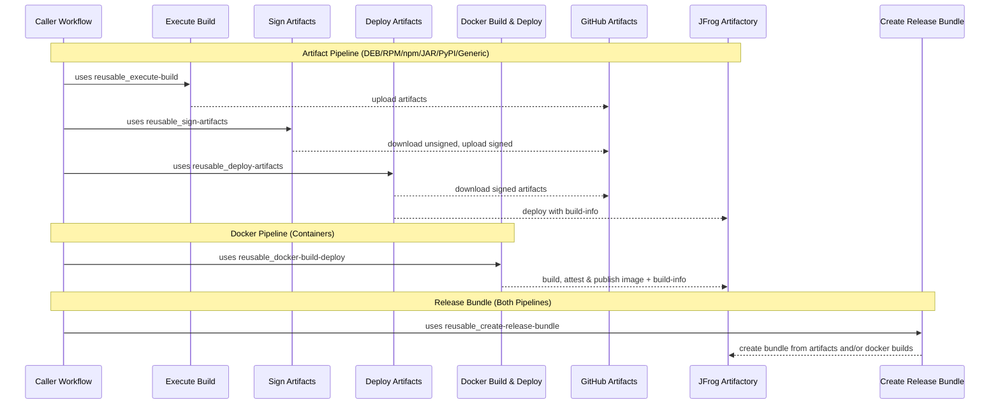

# Shared Workflows -- Composable CI/CD

> If the standard orchestrated workflows fit your needs, see [CICD-standard.md](https://github.com/aerospike/shared-workflows/blob/main/.github/workflows/docs/CICD-standard.md) for the simpler approach. This guide covers the composable path, where you call the lower-level workflows directly and wire the stages together yourself.

---

## When to use composable workflows

The orchestrated `reusable_artifacts-cicd.yaml` handles build → sign → deploy as a single call. The composable approach gives you the same building blocks but wired together in your own workflow, so you can insert custom steps between stages, run parallel deploys to multiple targets, or otherwise shape the pipeline to your needs.

### Reusable workflows

| Workflow                              | Purpose                                                                                      |
| ------------------------------------- | -------------------------------------------------------------------------------------------- |
| `reusable_execute-build.yaml`         | Run a build script, upload artifacts to GitHub Artifacts, publish build-info to JFrog        |
| `reusable_sign-artifacts.yaml`        | Download unsigned artifacts, GPG-sign deb/rpm/generic files, SSL.com-sign nupkg files        |
| `reusable_deploy-artifacts.yaml`      | Download signed artifacts, upload to JFrog Artifactory (auto-routes by file extension)       |
| `reusable_create-release-bundle.yaml` | Create JFrog release bundle from one or more builds (standalone, handles checkout and setup) |

### Composite actions

| Action                    | Purpose                                                                      |
| ------------------------- | ---------------------------------------------------------------------------- |
| `collect-build-artifacts` | Merge per-matrix GitHub Artifacts into a single artifact for downstream jobs |
| `create-release-bundle`   | Create a JFrog release bundle from one or more builds                        |
| `delete-release-bundle`   | Delete an existing release bundle version (safe no-op if it doesn't exist)   |
| `promote-release-bundle`  | Promote a release bundle to a target environment (DEV, TEST, PROD, etc.)     |

## High-level flow



Internally, GitHub Actions artifacts are used for _in-runner handoff_ between stages; JFrog deployments are used for _durable discovery and consumption_ beyond the workflow.

---

## Composable artifact pipeline

See [example_composable-matrix.yaml](https://github.com/aerospike/shared-workflows/blob/main/.github/workflows/example_composable-matrix.yaml) for the complete working example. It demonstrates DEB/RPM, npm, and Java/Maven builds with a custom test step inserted between build and sign:

```text
extract-version  →  build (matrix + npm + java)  →  collect  →  [your tests]  →  sign  →  deploy
```

With release bundles (shown in the example for `workflow_dispatch`):

```text
deploy  →  create-release-bundle  →  promote
```

### Key concepts

**Build IDs.** The `jf-build-id` ties build-info together across stages. Use `${{ github.run_id }}-${{ github.run_attempt }}` as the base. Each build job adds a unique suffix; the deploy job uses the base without the suffix.

```text
Per-matrix build:  {run_id}-{run_attempt}-buildinfo-{distro}-{arch}
Ecosystem build:   {run_id}-{run_attempt}-buildinfo-npm-x86_64
Metadata prefix:   {run_id}-{run_attempt}-buildinfo
Deploy parent:     {run_id}-{run_attempt}
```

**Artifact naming.** Each build job uploads with a distinct name (e.g., `build-artifacts-el9-x86_64`, `build-artifacts-npm-x86_64`). The `collect-build-artifacts` action merges these into a single `build-artifacts` artifact that sign and deploy consume.

**Collecting matrix artifacts.** Use the `collect-build-artifacts` composite action after all build jobs complete. It downloads all artifacts matching a pattern (default `build-artifacts-*`) and re-uploads them as one merged artifact:
**Signing secrets.** GPG keys (and SSL.com credentials if nupkg files are present) must be available.

**Java/Maven setup.** Pass `setup-java: true` to `reusable_execute-build.yaml` along with optional `java-version` (default `"21"`), `java-distribution` (default `temurin`), and `java-cache` (default `maven`). For JAR artifacts, pass `jar-group-id` to `reusable_deploy-artifacts.yaml` as a Maven group ID fallback when JAR metadata doesn't include one.

### Build-info architecture

The pipeline produces three kinds of JFrog build-info records that form a parent-child tree. You are responsible for passing consistent build IDs between stages.

Each pipeline run produces:

```text
my-app / 1234567-1                                (parent)
├── my-app / 1234567-1-buildinfo-el9-x86_64        (metadata child)
├── my-app / 1234567-1-buildinfo-npm-x86_64         (metadata child)
├── my-app / 1234567-1-buildinfo-java-x86_64        (metadata child)
└── my-app / 1234567-1-artifacts                    (artifact child)
```

The suffixes after `buildinfo-` are yours to choose. Use whatever uniquely identifies the build variant: `-{distro}-{arch}` for OS matrix builds, `-npm-x86_64` or `-java-x86_64` for ecosystem-specific builds, etc. The only requirement is that all metadata children share the `jf-metadata-build-id` prefix so the deploy stage can discover them via AQL.

**Metadata children** (produced by `reusable_execute-build.yaml`). One per build job. Each publishes a build-info containing CI environment variables and git commit/branch but no artifact references, because artifacts are uploaded later by a different job on a different runner.

**The artifact child** (produced by `reusable_deploy-artifacts.yaml`). Created during deployment when artifacts are uploaded to JFrog. Each `jf rt upload` call tags the artifact with this build number (`{jf-build-id}-artifacts`), so JFrog knows which files belong to this build.

**The parent** (produced by `reusable_deploy-artifacts.yaml`). At the end of deployment, the deploy entrypoint discovers all metadata children via an AQL query using the `jf-metadata-build-id` prefix, appends them and the artifact child via `jf rt build-append`, then publishes the parent. This is the single record that ties everything together.

Release bundles reference the parent build-info by `name:version`, providing a complete chain of custody from source to distributable.

#### How the IDs connect

| Input                        | Value                                       | Used by                                       |
| ---------------------------- | ------------------------------------------- | --------------------------------------------- |
| `jf-build-id` (build stage)  | `{run}-{attempt}-buildinfo-{unique-suffix}` | Metadata child build number                   |
| `jf-build-id` (deploy stage) | `{run}-{attempt}`                           | Parent build number                           |
| `jf-metadata-build-id`       | `{run}-{attempt}-buildinfo`                 | Prefix for AQL discovery of metadata children |
| _(derived internally)_       | `{jf-build-id}-artifacts`                   | Artifact child build number                   |

The deploy stage uses `jf-metadata-build-id` as a search prefix to find all metadata children published during the build stage. This is why per-matrix build IDs must start with the metadata prefix and add a unique suffix.

### Release bundle lifecycle

At Aerospike, release bundles are the only way artifacts are promoted between environments. See [Release Bundles](https://github.com/aerospike/shared-workflows/blob/main/.github/workflows/docs/release-bundles.md) for the full guide covering the promotion pipeline, usage, and troubleshooting.

## Full examples

- [example_composable-matrix.yaml](https://github.com/aerospike/shared-workflows/blob/main/.github/workflows/example_composable-matrix.yaml): multi-ecosystem matrix builds (DEB/RPM, npm, Java) with custom test step, release bundle lifecycle, and promotion
- [example_reusable-integration.yaml](https://github.com/aerospike/shared-workflows/blob/main/.github/workflows/example_reusable-integration.yaml): end-to-end pipeline combining artifact and Docker pipelines with a unified release bundle

---

See [Why gh-workflows-ref is required](https://github.com/aerospike/shared-workflows/blob/main/.github/workflows/docs/why-gh-workflows-ref.md) for details on this GitHub Actions limitation.

---

## Troubleshooting tips

- **Deploy fails (auth)** → confirm GitHub→JFrog **OIDC** trust/policy is configured and that the workflow's identity has deploy permission to the target project/repo. Common mistakes: wrong audience or incorrect token permissions.
- **Docker push fails** → ensure `tag` includes the full registry path (e.g., `artifact.aerospike.io/project-docker-dev-local/image:tag`). Verify JFrog registry permissions and OIDC authentication.
- **Bundle issues** → see the troubleshooting section in [Release Bundles](https://github.com/aerospike/shared-workflows/blob/main/.github/workflows/docs/release-bundles.md#troubleshooting).

---
