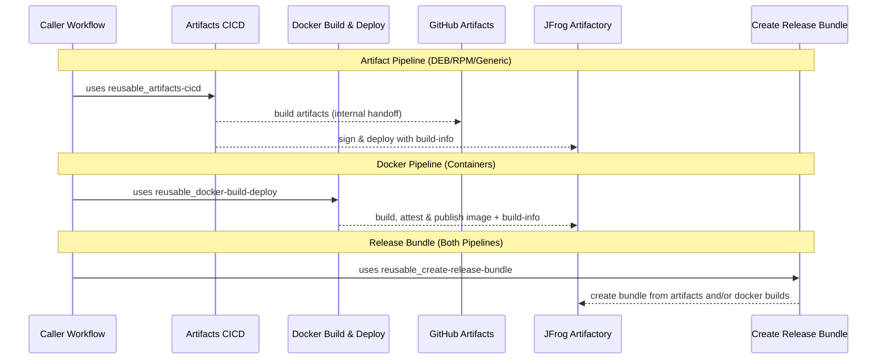

# Shared Workflows – Standard CI/CD

This is the recommended starting point for all repositories. These orchestrated workflows handle the full lifecycle with good defaults — you provide a build script and configuration, they handle the rest.

If you hit a wall and need more control, see [CICD-with-shared-actions.md](CICD-with-shared-actions.md) for the composable approach.

---

## High-level flow



The architecture follows an ecosystem-specific build & sign pattern, where artifacts are built and secured according to their type (DEB/RPM with GPG, Docker with attestations), then unified at the release bundle step.

### Artifact Pipeline (DEB, RPM, Generic files)

1. **Artifacts CICD** → compile/build, sign, deploy your project and produce artifacts

### Docker Pipeline (Container images)

1. **Docker Build & Deploy** → build, attest (SLSA provenance), and publish OCI images

### Unified Release

**Create Release Bundle** → combine artifacts and/or docker builds into a single distributable release bundle

## Standard Workflows for your project

These orchestrated workflows are the expected entry points for all repositories:

- `reusable_artifacts-cicd.yaml`: **Artifacts pipeline** (build → sign → deploy). [README](https://github.com/aerospike/shared-workflows/blob/main/.github/workflows/artifacts-cicd/README.md)
- `reusable_docker-build-deploy.yaml`: **Docker pipeline** (container images with SLSA attestations). [README](https://github.com/aerospike/shared-workflows/blob/main/.github/workflows/docker-build-deploy/README.md)
- `reusable_create-release-bundle.yaml`: **Release bundles** (combines artifact + docker outputs). [README](https://github.com/aerospike/shared-workflows/blob/main/.github/workflows/create-release-bundle/README.md)

The lower-level workflows (`reusable_execute-build.yaml`, `reusable_sign-artifacts.yaml`, `reusable_deploy-artifacts.yaml`) are internal implementation details. If you find yourself calling them directly, that's usually a sign the orchestrator needs a new capability or the build process should be restructured to fit the standard path.

### Artifacts CI/CD

This orchestrates the full build → sign → deploy lifecycle internally.

```yaml
jobs:
  ci:
    uses: aerospike/shared-workflows/.github/workflows/reusable_artifacts-cicd.yaml@v3.2.0
    with:
      gh-workflows-ref: v3.2.0 # Must match @v3.2.0 above
      jf-project: my-project
      jf-build-name: my-app
      version: 1.2.3
      gh-artifact-directory: dist
      build-script: |
        make build

      # Optional:
    secrets: inherit
```

Notes:

- `reusable_artifacts-cicd.yaml` generates a unique parent `jf-build-id` internally (millisecond timestamp) and uses a distinct metadata build-id for the build-info produced during the build.
- Signing is always enabled; provide the required signing secrets (GPG, and SSL.com secrets if `.nupkg` files are present). Using `secrets: inherit` is simplest.

### Simple matrix builds (optional)

Use `matrix-json` to run a constrained matrix while keeping the rest of the workflow simple. Each matrix job publishes its own build-info and artifacts, then the workflow aggregates build-info and merges artifacts before signing/deploying.

`matrix-json` must conform to `https://github.com/aerospike/shared-workflows/blob/main/.github/workflows/docs/artifacts-cicd-matrix.schema.json`.

Use matrix fields for values the workflow already expects (`runs-on`, `distro`, `arch`). Use `build-env` only for extra variables your script needs. Use `\;` for literal semicolons.

Matrix entries can override these per-build settings:

- `working-directory`
- `gh-artifact-directory`
- `build-script`
- `build-script-path`
- `build-env`
- `setup-dotnet`
- `dotnet-version`

Precedence is always: **matrix entry override → workflow input defaults**.

```yaml
jobs:
  ci:
    uses: aerospike/shared-workflows/.github/workflows/reusable_artifacts-cicd.yaml@v3.2.0
    with:
      gh-workflows-ref: v3.2.0
      jf-project: my-project
      jf-build-name: my-app
      version: 1.2.3
      gh-artifact-directory: dist
      build-script: |
        make build
      matrix-json: >-
        {"include":[
          {"runs-on":"ubuntu-22.04","distro":"jammy","arch":"x86_64"},
          {"runs-on":"ubuntu-22.04","distro":"noble","arch":"x86_64"}
        ]}
    secrets: inherit
```

#### Dotnet matrix entry example

```yaml
matrix-json: >-
  {"include":[
    {
      "runs-on":"ubuntu-22.04",
      "working-directory":"src/dotnet",
      "gh-artifact-directory":"src/dotnet/artifacts",
      "build-script":"./scripts/build-dotnet.sh",
      "build-env":"DOTNET_SYSTEM_GLOBALIZATION_INVARIANT=1",
      "setup-dotnet":true,
      "dotnet-version":"8.0.x"
    }
  ]}
```

## Example Usage

The typical pattern combines both pipelines: Build and sign according to ecosystem, then unify in a release bundle.

```yaml
jobs:
  # Artifact pipeline: build → sign → deploy (all handled by the orchestrator)
  artifacts:
    uses: aerospike/shared-workflows/.github/workflows/reusable_artifacts-cicd.yaml@v3.2.0
    with:
      gh-workflows-ref: v3.2.0
      jf-project: my-project
      jf-build-name: my-app
      version: 1.2.3
      gh-artifact-directory: dist
      build-script: |
        make build
    secrets: inherit

  # Docker pipeline: build with attestations → deploy
  docker:
    uses: aerospike/shared-workflows/.github/workflows/reusable_docker-build-deploy.yaml@v3.2.0
    with:
      attest: true # SLSA attestation (container ecosystem standard)
      sbom: true # Software Bill of Materials
      # ... docker config ...

  # Unified release: bundle all builds together
  release-bundle:
    needs: [artifacts, docker]
    uses: aerospike/shared-workflows/.github/workflows/reusable_create-release-bundle.yaml@v3.2.0
    with:
      gh-workflows-ref: v3.2.0
      jf-build-names: "my-app:1.2.3,my-app-container:1.2.3"
      # Single bundle containing both artifact and container builds
```

For a drop-in artifacts-cicd example see [example_artifacts-cicd.yaml](https://github.com/aerospike/shared-workflows/blob/main/.github/workflows/example_artifacts-cicd.yaml).

---

## Why gh-workflows-ref is required

All shared workflows require the `gh-workflows-ref` input, which **should match** the version in your `uses:` line:

```yaml
jobs:
  build:
    uses: aerospike/shared-workflows/.github/workflows/reusable_artifacts-cicd.yaml@v3.2.0
    with:
      gh-workflows-ref: v3.2.0 # Should match @v3.2.0 above
      # ... other inputs ...
```

### The problem

GitHub Actions has a fundamental limitation: **reusable workflows cannot access their own ref**. When you call `uses: org/repo/.github/workflows/workflow.yaml@v3.2.0`, the workflow itself has no way to know it was called with `@v3.2.0`.

The available context variables don't help:

- `github.sha` → SHA of the _caller's_ commit, not shared-workflows
- `github.workflow_sha` → SHA of the _caller's_ workflow file, not the reusable one
- `github.ref` → ref of the _caller's_ repository

There is no `github.called_workflow_ref` or similar.

### Why this matters

These workflows need to checkout their own repository to access entrypoint scripts (bash scripts that do the actual work). Without knowing which version was called, they can't checkout the matching scripts — leading to version mismatches where the workflow is v3.2.0 but the scripts are from a different version.

### Known issue

This is a long-standing GitHub Actions limitation with no native solution:

- [actions/runner#2417](https://github.com/actions/runner/issues/2417)
- [community/discussions#38659](https://github.com/orgs/community/discussions/38659)

Third-party workarounds exist but don't pass security review. Until GitHub adds native support, `gh-workflows-ref` is the reliable solution.

---

## Troubleshooting tips

- **Deploy fails (auth)** → confirm GitHub→JFrog **OIDC** trust/policy is configured and that the workflow's identity has deploy permission to the target project/repo. (example mistakes often around wrong audience or incorrect token permissions)
- **Docker push fails** → ensure `tag` includes the full registry path (e.g., `artifact.aerospike.io/project-docker-dev-local/image:tag`). Verify JFrog registry permissions and OIDC authentication.
- **Bundle creation issues** → confirm the `jf-build-names` input is a comma-separated list of `name:version` pairs that exist for the specified build, and that your JFrog project/repo permissions allow bundle creation. This permission is higher than upload/download so often a source of error.

---
