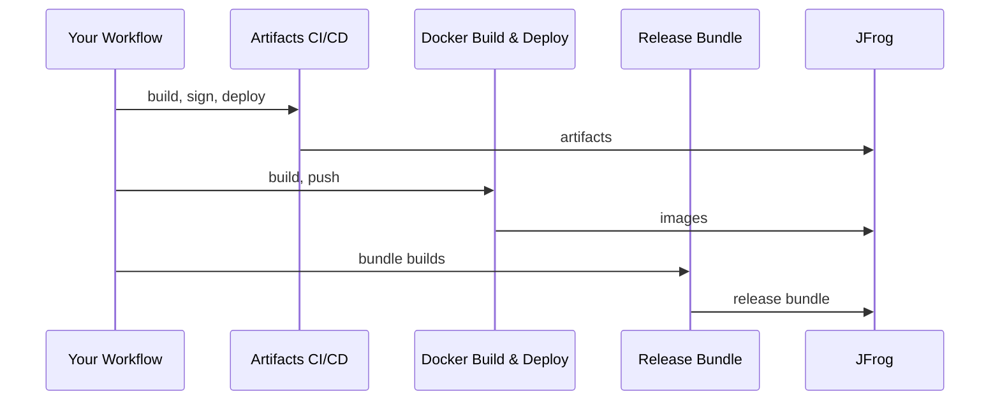

# Shared Workflows – Standard CI/CD

These orchestrated workflows handle the full lifecycle with good defaults: you provide a build script and configuration, they handle the rest. This is the simpler of two approaches; if you need to insert custom steps between pipeline stages or otherwise need finer-grained control, see [CICD-composable.md](https://github.com/aerospike/shared-workflows/blob/main/.github/workflows/docs/CICD-composable.md).

---

## High-level flow



The architecture follows an ecosystem-specific build & sign pattern, where artifacts are built and secured according to their type (DEB/RPM with GPG, Docker with attestations), then unified at the release bundle step.

### Artifact Pipeline (DEB, RPM, Generic files)

1. **Artifacts CICD** → compile/build, sign, deploy your project and produce artifacts

### Docker Pipeline (Container images)

1. **Docker Build & Deploy** → build, attest (SLSA provenance), and publish OCI images

### Unified Release

**Create Release Bundle** → combine artifacts and/or docker builds into a single distributable release bundle

## Workflow permissions

Caller workflows need at least:

```yaml
permissions:
  contents: read
  id-token: write
```

Since v3.8.0, deploy can upload optional Maven bundle metadata (`.maven-bundle-metadata.json`) for release-bundle annotation. If your pipeline builds Maven/JAR artifacts and chains into `reusable_create-release-bundle.yaml` via that metadata artifact, add `actions: write` to the caller workflow (or job) permissions. Without it, deploy to JFrog still succeeds; only the metadata upload step fails when metadata is produced.

## Standard Workflows for your project

- `reusable_artifacts-cicd.yaml`: **Artifacts pipeline** (build → sign → deploy). [README](https://github.com/aerospike/shared-workflows/blob/main/.github/workflows/artifacts-cicd/README.md)
- `reusable_docker-build-deploy.yaml`: **Docker pipeline** (container images with SLSA attestations). [README](https://github.com/aerospike/shared-workflows/blob/main/.github/workflows/docker-build-deploy/README.md)
- `reusable_create-release-bundle.yaml`: **Release bundles** (combines artifact + docker outputs). [README](https://github.com/aerospike/shared-workflows/blob/main/.github/workflows/create-release-bundle/README.md)

The lower-level workflows (`reusable_execute-build.yaml`, `reusable_sign-artifacts.yaml`, `reusable_deploy-artifacts.yaml`) are the building blocks used internally by the orchestrators. They're also available directly if you're following the composable approach.

### Artifacts CI/CD

This orchestrates the full build → sign → deploy lifecycle internally.

```yaml
permissions:
  contents: read
  id-token: write
  # actions: write  # add when building Maven/JAR artifacts and using bundle metadata upload

jobs:
  ci:
    uses: aerospike/shared-workflows/.github/workflows/reusable_artifacts-cicd.yaml@v3.2.0
    with:
      gh-workflows-ref: v3.2.0 # Must match @v3.2.0 above
      jf-project: my-project
      jf-build-name: my-app
      version: 1.2.3
      gh-artifact-directory: dist
      build-script: |
        make build

      # Optional:
      build-type: release # Freeform label, applied as build.type target-prop on all artifacts
      internal: false # Set true to mark artifacts as internal-only (promotion control)
      jar-group-id: com.aerospike # Maven group ID fallback for JAR artifacts

      # Java/Maven setup (optional):
      setup-java: true
      java-version: "21" # Default: 21
      java-distribution: temurin # Default: temurin
      java-cache: maven # Default: maven

      # Python setup (optional):
      setup-python: true
      python-version: "3.12" # Default: 3.12

      # Dotnet setup (optional):
      setup-dotnet: true
      dotnet-version: "8.0" # Default: 8.0
    secrets: inherit
```

Notes:

- `reusable_artifacts-cicd.yaml` generates a unique parent `jf-build-id` internally (`GITHUB_RUN_ID-GITHUB_RUN_ATTEMPT`) and uses a distinct metadata build-id (`{jf-build-id}-buildinfo`) for the build-info produced during the build.
- Signing is always enabled; provide the required signing secrets (GPG, plus SSL.com secrets if `.nupkg` files or Windows executables are present). Using `secrets: inherit` is simplest.
- All artifacts get `version` and `package_name` target-props automatically. DEB/RPM also get distribution and architecture. Use `build-type` and `internal` for additional categorization.
- **Mac signing** is optional. Set `sign-mac: true` and provide `mac-signing-identity` plus the Apple secrets to enable Apple code signing, package signing (productsign), and notarization for `.pkg`, `.dmg`, and Mach-O binaries. Mac signing runs before GPG signing in the pipeline. See [sign-mac-artifacts README](https://github.com/aerospike/shared-workflows/blob/main/.github/workflows/sign-mac-artifacts/README.md) for secret setup.
- **Windows signing** is optional. Set `sign-windows: true` and provide the SSL.com eSigner secrets to enable Authenticode signing of `.exe`, `.msi`, and `.msix` files. Windows signing runs after Mac signing and before GPG signing. See [sign-win-artifacts README](https://github.com/aerospike/shared-workflows/blob/main/.github/workflows/sign-win-artifacts/README.md) for secret setup.
- **Java/Maven:** Set `setup-java: true` to have Java installed before your build script runs. Optionally set `java-version` (default `"21"`), `java-distribution` (default `temurin`), and `java-cache` (default `maven`). Matrix entries can override all four fields per build.
- **JAR artifacts:** Use `jar-group-id` to provide a Maven group ID fallback when the JAR metadata doesn't include one.
- **Python/PyPI:** Set `setup-python: true` to install Python and build tools (`build`, `twine`) before your build script runs. Optionally set `python-version` (default `"3.12"`). The deploy stage auto-detects `.whl` and `.tar.gz` sdist files and routes them to the appropriate PyPI repository. Matrix entries can override `setup-python` and `python-version` per build.
- **Go modules:** The deploy stage auto-detects Go module `.zip` archives (those containing `module@version/go.mod`) and routes them to the Go repository. At upload time, it extracts the `.mod` file and generates a `.info` JSON following the [GOPROXY protocol](https://go.dev/ref/mod#goproxy-protocol). No special setup inputs are needed. Your build script should produce a Go module zip with the standard `module@version/` prefix layout.
- **Helm charts:** Set `setup-helm: true` (and optionally `helm-version`, default `latest`) to install the Helm CLI before the build script runs. Matrix entries can override per build. The deploy stage auto-detects packaged Helm chart `.tgz` files (those containing `<chart>/Chart.yaml` with `apiVersion`, `name`, and `version`) and routes them to the project's classic Helm repository (`{project}-helm-dev-local`). Build script runs `helm package`; deploy ingests the resulting `.tgz`. JFrog auto-generates `index.yaml` from uploaded charts, so consumers `helm repo add` the repo URL and `helm install` from it. Signing is automatic: `sign-artifacts` produces a helm-native `.prov` (GPG-clearsigned Chart.yaml plus the chart's sha256) for every chart, and the `.prov` rides alongside the chart through deploy. Build scripts should use plain `helm package` (no `--sign`). See [artifacts-cicd README](https://github.com/aerospike/shared-workflows/blob/main/.github/workflows/artifacts-cicd/README.md) for the full Helm section including chart-testing pointers.
- **NuGet:** The deploy stage auto-detects `.nupkg` and `.snupkg` packages (validated via the embedded `.nuspec`) and routes them to the project's NuGet repository (`{project}-nuget-dev-local`). NuGet packages are signed with SSL.com eSigner rather than GPG; set `nuget-environment` to choose the eSigner signing environment (default `PROD`). No special setup input is required.
- **npm:** The deploy stage content-detects npm package tarballs (`.tgz` or `.tar.gz` containing a `package.json`) and routes them to the project's npm repository (`{project}-npm-dev-local`). No special setup input is required.
- **Windows executables:** `.exe`, `.msi`, and `.msix` files are detected by extension and routed to the project's generic repository (`{project}-generic-dev-local`). Enable Authenticode signing for them with `sign-windows` (see Windows signing below).

### Mac signing (optional)

To sign and notarize macOS artifacts (.pkg, .dmg, Mach-O binaries), add the `sign-mac` inputs:

```yaml
jobs:
  ci:
    uses: aerospike/shared-workflows/.github/workflows/reusable_artifacts-cicd.yaml@v3.2.0
    with:
      gh-workflows-ref: v3.2.0
      jf-project: my-project
      jf-build-name: my-app
      version: 1.2.3
      gh-artifact-directory: dist
      build-script: make build

      # Mac signing
      sign-mac: true
      mac-signing-identity: "Developer ID Application: Aerospike, Inc. (22224RFU67)"
      mac-installer-identity: "Developer ID Installer: Aerospike, Inc. (22224RFU67)"
      mac-artifact-glob: "*.pkg" # Only sign .pkg files; other artifacts pass through
      mac-notarize: true # Default: true
      mac-runs-on: macos-14 # Default: macos-14
    secrets: inherit
```

The pipeline runs platform signing before GPG signing: `collect -> sign-mac -> sign-windows -> sign (GPG) -> deploy`. Apple and Authenticode signing modify files in place, while GPG creates detached `.asc` signatures. Running Mac and Windows signing first ensures the GPG signatures match the final file contents.

Required secrets (set at org or repo level): `APPLE_APPLICATION_CERT`, `APPLE_CERT_PASSWORD`, `APPLE_ID`, `APPLE_INSTALLER_CERT`, `APPLE_NOTARIZATION_PASSWORD`, `APPLE_TEAM_ID`. See the [sign-mac-artifacts README](https://github.com/aerospike/shared-workflows/blob/main/.github/workflows/sign-mac-artifacts/README.md) for setup instructions.

### Windows signing (optional)

To Authenticode-sign Windows executables (.exe, .msi, .msix) via SSL.com eSigner, add the `sign-windows` inputs:

```yaml
jobs:
  ci:
    uses: aerospike/shared-workflows/.github/workflows/reusable_artifacts-cicd.yaml@v3.2.0
    with:
      gh-workflows-ref: v3.2.0
      jf-project: my-project
      jf-build-name: my-app
      version: 1.2.3
      gh-artifact-directory: dist
      build-script: make build-windows

      # Windows signing
      sign-windows: true
      win-artifact-glob: "*.exe,*.msi,*.msix" # Default: **/*
      win-signing-identity: "My Product Inc." # Optional display name for installers
      win-runs-on: windows-2025 # Default: windows-2025
    secrets: inherit
```

Windows signing runs after Mac signing and before GPG signing (`collect -> sign-mac -> sign-windows -> sign -> deploy`), so the signed executables flow through to deploy and any later GPG `.asc` signatures match the signed bytes. Signing uses SSL.com CodeSignTool with an OV certificate.

Required secrets (set at org or repo level): `ES_OV_USERNAME`, `ES_OV_PASSWORD`, `ES_OV_CREDENTIAL_ID`, `ES_OV_TOTP_SECRET`. These are SSL.com eSigner account credentials. See the [sign-win-artifacts README](https://github.com/aerospike/shared-workflows/blob/main/.github/workflows/sign-win-artifacts/README.md) for setup instructions.

### Build-info

The orchestrator publishes JFrog build-info records that trace artifacts back to the environment and commit that produced them. You don't need to manage this directly, but understanding the structure helps when inspecting builds in JFrog or debugging deployment issues.

Each pipeline run produces a tree of build-info records:

```text
my-app / 1234567-1                                (parent)
├── my-app / 1234567-1-buildinfo-el9-x86_64        (metadata child)
├── my-app / 1234567-1-buildinfo-jammy-x86_64      (metadata child)
└── my-app / 1234567-1-artifacts                    (artifact child)
```

The suffixes after `buildinfo-` vary by build type. The orchestrator uses `-{distro}-{arch}` for its matrix, but composable callers may use any unique suffix (e.g., `-npm`, `-dotnet`, `-java`). The only requirement is that all metadata children share the same prefix so the deploy stage can discover them.

**Metadata children** are published during the build stage, one per matrix variant (or per build job in a non-matrix pipeline). They capture the CI environment variables and git commit/branch on the worker that ran the build. They contain no artifact references, because artifacts are uploaded later by the deploy job on a separate runner.

**The artifact child** is published during the deploy stage. Each artifact uploaded to JFrog is tagged with this build number, linking the files to the build.

**The parent** is assembled at the end of the deploy stage. The deploy entrypoint discovers all metadata children, appends them along with the artifact child, then publishes the parent as a single record: these artifacts, from these environments, at this commit.

Release bundles reference the parent build-info by name and version, providing a complete chain of custody from source to distributable.

### Simple matrix builds (optional)

Use `matrix-json` to run a constrained matrix while keeping the rest of the workflow simple. Each matrix job publishes its own build-info and artifacts, then the workflow aggregates build-info and merges artifacts before signing/deploying.

`matrix-json` must conform to `https://github.com/aerospike/shared-workflows/blob/main/.github/workflows/docs/artifacts-cicd-matrix.schema.json`.

Use matrix fields for values the workflow already expects (`runs-on`, `distro`, `arch`). Use `build-env` only for extra variables your script needs. Use `\;` for literal semicolons.

Matrix entries can override these per-build settings:

- `working-directory`
- `gh-artifact-directory`
- `build-script`
- `build-script-path`
- `build-env`
- `setup-dotnet`
- `dotnet-version`
- `setup-java`
- `java-version`
- `java-distribution`
- `java-cache`
- `setup-python`
- `python-version`

Precedence is always: **matrix entry override → workflow input defaults**.

```yaml
jobs:
  ci:
    uses: aerospike/shared-workflows/.github/workflows/reusable_artifacts-cicd.yaml@v3.2.0
    with:
      gh-workflows-ref: v3.2.0
      jf-project: my-project
      jf-build-name: my-app
      version: 1.2.3
      gh-artifact-directory: dist
      build-script: |
        make build
      matrix-json: >-
        {"include":[
          {"runs-on":"ubuntu-22.04","distro":"jammy","arch":"x86_64"},
          {"runs-on":"ubuntu-22.04","distro":"noble","arch":"x86_64"}
        ]}
    secrets: inherit
```

#### Dotnet matrix entry example

```yaml
matrix-json: >-
  {"include":[
    {
      "runs-on":"ubuntu-22.04",
      "working-directory":"src/dotnet",
      "gh-artifact-directory":"src/dotnet/artifacts",
      "build-script":"./scripts/build-dotnet.sh",
      "build-env":"DOTNET_SYSTEM_GLOBALIZATION_INVARIANT=1",
      "setup-dotnet":true,
      "dotnet-version":"8.0.x"
    }
  ]}
```

#### Java/Maven matrix entry example

```yaml
matrix-json: >-
  {"include":[
    {
      "runs-on":"ubuntu-22.04",
      "distro":"jammy",
      "arch":"x86_64",
      "build-script":"mvn -B package",
      "gh-artifact-directory":"target",
      "setup-java":true,
      "java-version":"17",
      "java-distribution":"temurin",
      "java-cache":"maven"
    }
  ]}
```

#### Python/PyPI matrix entry example

```yaml
matrix-json: >-
  {"include":[
    {
      "runs-on":"ubuntu-22.04",
      "working-directory":"src/python",
      "gh-artifact-directory":"src/python/dist",
      "build-script":"python -m build",
      "setup-python":true,
      "python-version":"3.12"
    }
  ]}
```

#### Go module example

Go modules are source-only zip archives. Since Go has no built-in packaging command like `npm pack` or `python -m build`, the build script creates the zip manually with the required `module@version/` prefix:

```yaml
jobs:
  ci:
    uses: aerospike/shared-workflows/.github/workflows/reusable_artifacts-cicd.yaml@v3.2.0
    with:
      gh-workflows-ref: v3.2.0
      jf-project: my-project
      jf-build-name: my-gomod
      version: 1.2.3
      gh-artifact-directory: dist
      build-env: VERSION=1.2.3
      build-script: |
        read -r _ MODULE < go.mod
        TMP=$(mktemp -d)
        mkdir -p "$TMP/$MODULE@v$VERSION" dist
        cp go.mod *.go "$TMP/$MODULE@v$VERSION/"
        (cd "$TMP" && zip -qr "$OLDPWD/dist/hello-v$VERSION.zip" .)
        rm -rf "$TMP"
    secrets: inherit
```

#### Helm chart example

Helm charts use `helm package` in the build script. The sign stage automatically produces the `.prov` provenance signature, and the deploy stage auto-detects the resulting `.tgz` + `.prov` and publishes them to the project's Helm repository:

```yaml
jobs:
  ci:
    uses: aerospike/shared-workflows/.github/workflows/reusable_artifacts-cicd.yaml@v3.2.0
    with:
      gh-workflows-ref: v3.2.0
      jf-project: my-project
      jf-build-name: my-chart
      version: 1.2.3
      gh-artifact-directory: dist
      build-env: VERSION=1.2.3
      build-script: |
        mkdir -p dist
        helm package charts/my-chart \
          --version "$VERSION" --app-version "$VERSION" \
          -d dist
      setup-helm: true
      # helm-version: "v3.16.4" # optional, defaults to latest
    secrets: inherit
```

`setup-helm: true` installs the Helm CLI via [azure/setup-helm](https://github.com/Azure/setup-helm) (SHA-pinned in the orchestrator) before the build script runs. The version defaults to `latest`; pin with `helm-version`. Matrix entries can set `setup-helm` and `helm-version` per build, mirroring the `setup-python`/`setup-java` pattern.

For chart linting and unit tests in PRs, run [chart-testing (`ct`)](https://github.com/helm/chart-testing) via the [helm/chart-testing-action](https://github.com/helm/chart-testing-action) as a separate workflow gated on `pull_request`. See [aerospike/helm-aerospike-vector-search](https://github.com/aerospike/helm-aerospike-vector-search) for a working `lint.yaml` and `.ct.yaml` you can copy.

## Full examples

- [example_artifacts-cicd.yaml](https://github.com/aerospike/shared-workflows/blob/main/.github/workflows/example_artifacts-cicd.yaml): drop-in orchestrated pipeline with multi-ecosystem matrix (C, .NET, npm, Java, Python, Go, Helm)
- [example_win-signing.yaml](https://github.com/aerospike/shared-workflows/blob/main/.github/workflows/example_win-signing.yaml): orchestrated pipeline with Windows Authenticode signing
- [example_expanded-integration.yaml](https://github.com/aerospike/shared-workflows/blob/main/.github/workflows/example_expanded-integration.yaml): exhaustive multi-ecosystem integration showcase

---

See [Why gh-workflows-ref is required](https://github.com/aerospike/shared-workflows/blob/main/.github/workflows/docs/why-gh-workflows-ref.md) for details on this GitHub Actions limitation.

---

## Troubleshooting tips

- **Workflow validation: "requesting 'actions: write', but is only allowed 'actions: none'"** → upgrade shared-workflows to a release where deploy scopes `actions: write` to the deploy job only (workflow-level permissions stay `contents: read` + `id-token: write`). If you use Maven bundle metadata upload, your caller workflow still needs `actions: write` at runtime.
- **Deploy fails on "Upload Maven bundle metadata"** → add `actions: write` to your caller workflow permissions, or set `gh-upload-bundle-metadata: false` on the deploy call if you do not need release-bundle metadata handoff.
- **Deploy fails (auth)** → confirm GitHub→JFrog **OIDC** trust/policy is configured and that the workflow's identity has deploy permission to the target project/repo. (example mistakes often around wrong audience or incorrect token permissions)
- **Docker push fails** → ensure `tag` includes the full registry path (e.g., `artifact.aerospike.io/project-docker-dev-local/image:tag`). Verify JFrog registry permissions and OIDC authentication.
- **Bundle issues** → see the troubleshooting section in [Release Bundles](https://github.com/aerospike/shared-workflows/blob/main/.github/workflows/docs/release-bundles.md#troubleshooting).

---
