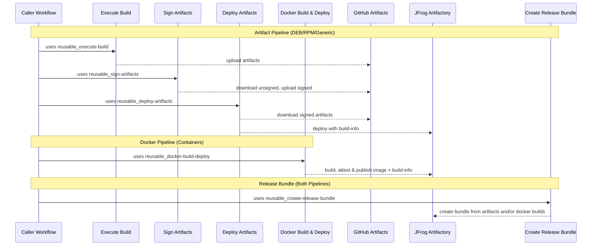

# Shared Workflows – CI/CD Walkthrough

This guide explains how Aerospike’s **shared, composable GitHub workflows** snap together into an end‑to‑end CI/CD pipeline.

---

## High‑level flow

The architecture follows an ecosystem-specific build & sign pattern, where artifacts are built and secured according to their type (DEB/RPM with GPG, Docker with attestations), then unified at the release bundle step.

### Artifact Pipeline (DEB, RPM, Generic files)

1. **Execute Build** → compile/build your project and produce artifacts
2. **Sign Artifacts** → apply GPG signatures (DEB/RPM ecosystem standard)
3. **Deploy Artifacts** → push signed artifacts to Artifactory with build metadata

### Docker Pipeline (Container images)

1. **Docker Build & Deploy** → build, attest (SLSA provenance), and publish OCI images

### Unified Release

**Create Release Bundle** → combine artifacts and/or docker builds into a single distributable release bundle

Each workflow is independent and composable. Internally actions artifacts are used for _in‑runner handoff_; deployments are used for _durable discovery and consumption_ beyond the workflow. Build and sign according to ecosystem requirements, then bundle everything together for release.



---

## Recommended: entrypoints

For most repositories, start with:

- `reusable_artifacts-cicd.yaml`: **Artifacts pipeline** (build → sign → deploy) with a small, opinionated input surface.
- `reusable_docker-build-deploy.yaml`: **Docker pipeline** (container images). This stays separate to avoid parameter explosion.

### Artifacts CI/CD (recommended)

This wraps `reusable_execute-build.yaml`, `reusable_sign-artifacts.yaml`, and `reusable_deploy-artifacts.yaml` for the common case.

```yaml
jobs:
  ci:
    uses: aerospike/shared-workflows/.github/workflows/reusable_artifacts-cicd.yaml@v2.0.3
    with:
      gh-workflows-ref: v2.0.3 # Must match @v2.0.3 above
      jf-project: my-project
      jf-build-name: my-app
      version: 1.2.3
      gh-artifact-directory: dist
      build-script: |
        make build

      # Optional:
      # preset: default|dotnet|custom (docker is not supported here; use reusable_docker-build-deploy.yaml)
    secrets: inherit
```

Notes:

- `reusable_artifacts-cicd.yaml` generates a unique parent `jf-build-id` internally (millisecond timestamp) and uses a distinct metadata build-id for the build-info produced during the build.
- If signing is enabled (via preset or override), you must provide the required signing secrets (GPG, and SSL.com secrets if `.nupkg` files are present). Using `secrets: inherit` is simplest.

### Simple matrix builds (optional)

Use `matrix-json` to run a constrained matrix while keeping the rest of the workflow simple. Each matrix job publishes its own build-info and artifacts, then the workflow aggregates build-info and merges artifacts before signing/deploying.

```yaml
jobs:
  ci:
    uses: aerospike/shared-workflows/.github/workflows/reusable_artifacts-cicd.yaml@v2.0.3
    with:
      gh-workflows-ref: v2.0.3
      jf-project: my-project
      jf-build-name: my-app
      version: 1.2.3
      gh-artifact-directory: dist
      build-script: |
        make build
      matrix-json: >-
        {"include":[
          {"runs-on":"ubuntu-22.04","distro":"jammy","arch":"x86_64"},
          {"runs-on":"ubuntu-22.04","distro":"noble","arch":"x86_64"}
        ]}
    secrets: inherit
```

## Example Usage

The typical pattern combines both pipelines: build and sign according to ecosystem, then unify in a release bundle.

```yaml
jobs:
  # Artifact pipeline: build → sign (GPG) → deploy
  build-artifacts:
    uses: aerospike/shared-workflows/.github/workflows/reusable_execute-build.yaml@v2.0.3
    with:
      gh-workflows-ref: v2.0.3 # Required: must match @v2.0.3 above
      # ... build deb/rpm/generic files ...

  sign-artifacts:
    needs: build-artifacts
    uses: aerospike/shared-workflows/.github/workflows/reusable_sign-artifacts.yaml@v2.0.3
    with:
      gh-workflows-ref: v2.0.3
      # ... GPG sign packages ...

  deploy-artifacts:
    needs: sign-artifacts
    uses: aerospike/shared-workflows/.github/workflows/reusable_deploy-artifacts.yaml@v2.0.3
    with:
      gh-workflows-ref: v2.0.3
      # ... deploy signed artifacts to JFrog ...

  # Docker pipeline: build with attestations → deploy
  build-docker:
    uses: aerospike/shared-workflows/.github/workflows/reusable_docker-build-deploy.yaml@v2.0.3
    with:
      attest: true # SLSA attestation (container ecosystem standard)
      sbom: true # Software Bill of Materials
      # ... docker config ...

  # Unified release: bundle all builds together
  release-bundle:
    needs: [deploy-artifacts, build-docker]
    uses: aerospike/shared-workflows/.github/workflows/reusable_create-release-bundle.yaml@v2.0.3
    with:
      gh-workflows-ref: v2.0.3
      jf-build-names: "myapp:${{ github.run_number }},myapp-container:${{ github.run_number }}"
      # Single bundle containing both artifact and container builds
```

For a complete working example see [example_reusable-integration.yaml](https://github.com/aerospike/shared-workflows/blob/main/.github/workflows/example_reusable-integration.yaml).

---

## Why gh-workflows-ref is required

All shared workflows require the `gh-workflows-ref` input, which **should match** the version in your `uses:` line:

```yaml
jobs:
  build:
    uses: aerospike/shared-workflows/.github/workflows/reusable_execute-build.yaml@v2.0.3
    with:
      gh-workflows-ref: v2.0.3 # Should match @v2.0.3 above
      # ... other inputs ...
```

### The problem

GitHub Actions has a fundamental limitation: **reusable workflows cannot access their own ref**. When you call `uses: org/repo/.github/workflows/workflow.yaml@v2.0.3`, the workflow itself has no way to know it was called with `@v2.0.3`.

The available context variables don't help:

- `github.sha` → SHA of the _caller's_ commit, not shared-workflows
- `github.workflow_sha` → SHA of the _caller's_ workflow file, not the reusable one
- `github.ref` → ref of the _caller's_ repository

There is no `github.called_workflow_ref` or similar.

### Why this matters

These workflows need to checkout their own repository to access entrypoint scripts (bash scripts that do the actual work). Without knowing which version was called, they can't checkout the matching scripts—leading to version mismatches where the workflow is v2.0.3 but the scripts are from a different version.

### Known issue

This is a long-standing GitHub Actions limitation with no native solution:

- [actions/runner#2417](https://github.com/actions/runner/issues/2417)
- [community/discussions#38659](https://github.com/orgs/community/discussions/38659)

Third-party workarounds exist but don't pass security review. Until GitHub adds native support, `gh-workflows-ref` is the reliable solution.

---

## Troubleshooting tips

- **Deploy fails (auth)** → confirm GitHub→JFrog **OIDC** trust/policy is configured and that the workflow's identity has deploy permission to the target project/repo. (example mistakes often around wrong audience or incorrect token permissions)
- **Docker push fails** → ensure `tag` includes the full registry path (e.g., `artifact.aerospike.io/project-container-dev-local/image:tag`). Verify JFrog registry permissions and OIDC authentication.
- **Bundle creation issues** → confirm the `jf-build-names` input is a comma‑separated list of `name:build_id` pairs that exist for the specified `version`, and that your JFrog project/repo permissions allow bundle creation. This permission is higher than upload/download so often a source of error.

---
