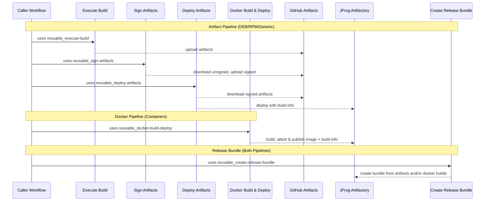

# Shared Workflows – Composable CI/CD

> **Start with the [standard CI/CD guide](CICD-standard.md) first.** The orchestrated workflows handle the full lifecycle and work for most repositories. This guide is the "eject" path — use it when you need fine-grained control over individual pipeline stages that the orchestrator doesn't support.

---

## When to use composable workflows

The orchestrated `reusable_artifacts-cicd.yaml` handles build → sign → deploy as a single call. If that doesn't fit your needs — for example, you need custom steps between build and sign, or you need to deploy to multiple targets with different configurations — you can call the lower-level workflows directly:

| Workflow                         | Purpose                                                                                |
| -------------------------------- | -------------------------------------------------------------------------------------- |
| `reusable_execute-build.yaml`    | Run a build script, upload artifacts to GitHub Artifacts, publish build-info to JFrog  |
| `reusable_sign-artifacts.yaml`   | Download unsigned artifacts, GPG-sign deb/rpm/generic files, SSL.com-sign nupkg files  |
| `reusable_deploy-artifacts.yaml` | Download signed artifacts, upload to JFrog Artifactory (auto-routes by file extension) |

## High-level flow



Internally, GitHub Actions artifacts are used for _in-runner handoff_ between stages; JFrog deployments are used for _durable discovery and consumption_ beyond the workflow.

---

## Composable artifact pipeline example

This is equivalent to what `reusable_artifacts-cicd.yaml` does internally, but gives you full control over each stage.

```yaml
jobs:
  build:
    uses: aerospike/shared-workflows/.github/workflows/reusable_execute-build.yaml@v3.2.0
    with:
      gh-workflows-ref: v3.2.0
      jf-project: my-project
      jf-build-name: my-app
      jf-build-id: "123456789" # Unique build ID (the orchestrator generates this automatically)
      gh-artifact-directory: dist
      build-script: |
        make build
    secrets: inherit

  # Optional: insert custom steps between build and sign
  # custom-step:
  #   needs: [build]
  #   ...

  sign:
    needs: [build]
    uses: aerospike/shared-workflows/.github/workflows/reusable_sign-artifacts.yaml@v3.2.0
    with:
      gh-workflows-ref: v3.2.0
      gh-unsigned-artifacts: build-artifacts # Must match gh-artifact-name from build (default)
    secrets: inherit

  deploy:
    needs: [sign]
    uses: aerospike/shared-workflows/.github/workflows/reusable_deploy-artifacts.yaml@v3.2.0
    with:
      gh-workflows-ref: v3.2.0
      jf-project: my-project
      jf-build-name: my-app
      jf-build-id: "123456789" # Same build ID as the build step
      jf-metadata-build-id: "123456789-buildinfo" # Distinct ID for build metadata
      version: 1.2.3
    secrets: inherit
```

Key things to note when composing manually:

- **`jf-build-id`** must be the same across build and deploy — it ties the build-info together
- **`jf-metadata-build-id`** is a separate ID used for the build metadata record (the orchestrator appends `-buildinfo` to the build ID)
- **`gh-artifact-name`** / **`gh-unsigned-artifacts`** must match between stages — this is how artifacts flow via GitHub Artifacts
- **Signing secrets** (GPG keys, and SSL.com credentials if nupkg files are present) must be available via `secrets: inherit`

## Full composable example with docker and release bundle

```yaml
jobs:
  # Artifact pipeline: build → sign → deploy (manual composition)
  build:
    uses: aerospike/shared-workflows/.github/workflows/reusable_execute-build.yaml@v3.2.0
    with:
      gh-workflows-ref: v3.2.0
      jf-project: my-project
      jf-build-name: my-app
      jf-build-id: "123456789"
      gh-artifact-directory: dist
      build-script: |
        make build
    secrets: inherit

  sign:
    needs: [build]
    uses: aerospike/shared-workflows/.github/workflows/reusable_sign-artifacts.yaml@v3.2.0
    with:
      gh-workflows-ref: v3.2.0
    secrets: inherit

  deploy:
    needs: [sign]
    uses: aerospike/shared-workflows/.github/workflows/reusable_deploy-artifacts.yaml@v3.2.0
    with:
      gh-workflows-ref: v3.2.0
      jf-project: my-project
      jf-build-name: my-app
      jf-build-id: "123456789"
      jf-metadata-build-id: "123456789-buildinfo"
      version: 1.2.3
    secrets: inherit

  # Docker pipeline: build with attestations → deploy
  docker:
    uses: aerospike/shared-workflows/.github/workflows/reusable_docker-build-deploy.yaml@v3.2.0
    with:
      attest: true
      sbom: true
      # ... docker config ...

  # Unified release: bundle all builds together
  release-bundle:
    needs: [deploy, docker]
    uses: aerospike/shared-workflows/.github/workflows/reusable_create-release-bundle.yaml@v3.2.0
    with:
      gh-workflows-ref: v3.2.0
      jf-build-names: "my-app:1.2.3,my-app-container:1.2.3"
```

For a complete working example see [example_artifacts-cicd.yaml](https://github.com/aerospike/shared-workflows/blob/main/.github/workflows/example_artifacts-cicd.yaml).

---

## Why gh-workflows-ref is required

All shared workflows require the `gh-workflows-ref` input, which **should match** the version in your `uses:` line:

```yaml
jobs:
  build:
    uses: aerospike/shared-workflows/.github/workflows/reusable_execute-build.yaml@v3.2.0
    with:
      gh-workflows-ref: v3.2.0 # Should match @v3.2.0 above
      # ... other inputs ...
```

### The problem

GitHub Actions has a fundamental limitation: **reusable workflows cannot access their own ref**. When you call `uses: org/repo/.github/workflows/workflow.yaml@v3.2.0`, the workflow itself has no way to know it was called with `@v3.2.0`.

The available context variables don't help:

- `github.sha` → SHA of the _caller's_ commit, not shared-workflows
- `github.workflow_sha` → SHA of the _caller's_ workflow file, not the reusable one
- `github.ref` → ref of the _caller's_ repository

There is no `github.called_workflow_ref` or similar.

### Why this matters

These workflows need to checkout their own repository to access entrypoint scripts (bash scripts that do the actual work). Without knowing which version was called, they can't checkout the matching scripts — leading to version mismatches where the workflow is v3.2.0 but the scripts are from a different version.

### Known issue

This is a long-standing GitHub Actions limitation with no native solution:

- [actions/runner#2417](https://github.com/actions/runner/issues/2417)
- [community/discussions#38659](https://github.com/orgs/community/discussions/38659)

Third-party workarounds exist but don't pass security review. Until GitHub adds native support, `gh-workflows-ref` is the reliable solution.

---

## Troubleshooting tips

- **Deploy fails (auth)** → confirm GitHub→JFrog **OIDC** trust/policy is configured and that the workflow's identity has deploy permission to the target project/repo. (example mistakes often around wrong audience or incorrect token permissions)
- **Docker push fails** → ensure `tag` includes the full registry path (e.g., `artifact.aerospike.io/project-docker-dev-local/image:tag`). Verify JFrog registry permissions and OIDC authentication.
- **Bundle creation issues** → confirm the `jf-build-names` input is a comma-separated list of `name:version` pairs that exist for the specified build, and that your JFrog project/repo permissions allow bundle creation. This permission is higher than upload/download so often a source of error.

---
