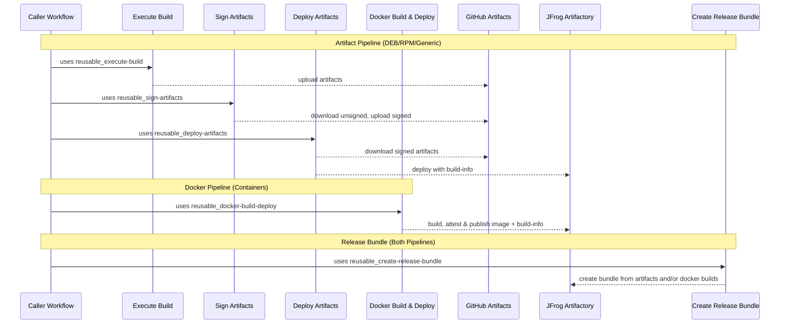

# Shared Workflows – CI/CD Walkthrough

This guide explains how Aerospike’s **shared, composable GitHub workflows** snap together into an end‑to‑end CI/CD pipeline.

---

## High‑level flow

The architecture follows an ecosystem-specific build & sign pattern, where artifacts are built and secured according to their type (DEB/RPM with GPG, Docker with attestations), then unified at the release bundle step.

### Artifact Pipeline (DEB, RPM, Generic files)

1. **Execute Build** → compile/build your project and produce artifacts
2. **Sign Artifacts** → apply GPG signatures (DEB/RPM ecosystem standard)
3. **Deploy Artifacts** → push signed artifacts to Artifactory with build metadata

### Docker Pipeline (Container images)

1. **Docker Build & Deploy** → build, attest (SLSA provenance), and publish OCI images

### Unified Release

**Create Release Bundle** → combine artifacts and/or docker builds into a single distributable release bundle

Each workflow is independent and composable. Internally actions artifacts are used for _in‑runner handoff_; use Artifactory coordinates are used for _durable discovery and consumption_ beyond the workflow. Build and sign according to ecosystem requirements, then bundle everything together for release.



---

## Example Usage

The typical pattern combines both pipelines: build and sign according to ecosystem, then unify in a release bundle.

```yaml
jobs:
  # Artifact pipeline: build → sign (GPG) → deploy
  build-artifacts:
    uses: aerospike/shared-workflows/.github/workflows/reusable_execute-build.yaml@<sha>
    # ... build deb/rpm/generic files ...

  sign-artifacts:
    needs: build-artifacts
    uses: aerospike/shared-workflows/.github/workflows/reusable_sign-artifacts.yaml@<sha>
    # ... GPG sign packages ...

  deploy-artifacts:
    needs: sign-artifacts
    uses: aerospike/shared-workflows/.github/workflows/reusable_deploy-artifacts.yaml@<sha>
    # ... deploy signed artifacts to JFrog ...

  # Docker pipeline: build with attestations → deploy
  build-docker:
    uses: aerospike/shared-workflows/.github/workflows/reusable_docker-build-deploy.yaml@<sha>
    with:
      attest: true # SLSA attestation (container ecosystem standard)
      sbom: true # Software Bill of Materials
      # ... docker config ...

  # Unified release: bundle all builds together
  release-bundle:
    needs: [deploy-artifacts, build-docker]
    uses: aerospike/shared-workflows/.github/workflows/reusable_create-release-bundle.yaml@<sha>
    with:
      jf-build-names: "myapp:${{ github.run_number }},myapp-container:${{ github.run_number }}"
      # Single bundle containing both artifact and container builds
```

For a complete working example see [example_reusable-integration.yaml](https://github.com/aerospike/shared-workflows/blob/main/.github/workflows/example_reusable-integration.yaml).

---

## Troubleshooting tips

- **Deploy fails (auth)** → confirm GitHub→JFrog **OIDC** trust/policy is configured and that the workflow's identity has deploy permission to the target project/repo. (example mistakes often around wrong audience or incorrect token permissions)
- **Docker push fails** → ensure `tag` includes the full registry path (e.g., `artifact.aerospike.io/project-container-dev-local/image:tag`). Verify JFrog registry permissions and OIDC authentication.
- **Bundle creation issues** → confirm the `jf-build-names` input is a comma‑separated list of `name:build_id` pairs that exist for the specified `version`, and that your JFrog project/repo permissions allow bundle creation. This permission is higher than upload/download so often a source of error.

---
