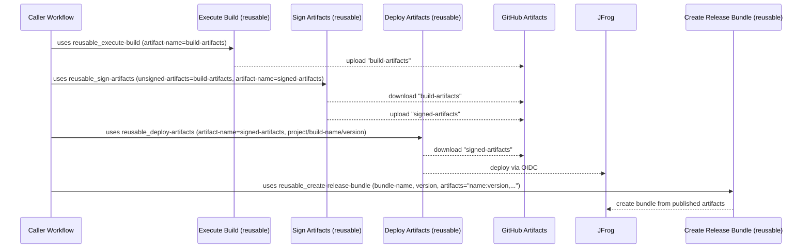

# Shared Workflows – CI/CD Walkthrough

This guide explains how Aerospike’s **shared, composable GitHub workflows** snap together into an end‑to‑end CI/CD pipeline.

---

## High‑level flow

A typical pipeline chains these reusable workflows:

1. **Execute Build** → compile/build your project and produce artifacts
2. **Sign Artifacts** → apply GPG signatures to the built artifacts
3. **Deploy Artifacts** → push signed artifacts to Artifactory/JFrog with the right metadata
4. **Create Release Bundle** → package uploaded artifacts into a release bundle (optional or release‑only)

Each step is independent and composable; you can run them all or just the subset your repo needs.



---

## Short example

```yaml
name: Example – Build → Sign → Deploy → Bundle

on:
  push:
    branches: [main]
  workflow_dispatch: {}

jobs:
  build:
    name: Execute Build
    uses: aerospike/shared-workflows/.github/workflows/reusable_execute-build.yaml@<sha> # vX.Y.Z
    with:
      # Provide either an inline script or a path to one
      build-script: |
        make clean && make all
      # build-script-path: ci/build.sh
      artifact-directory: dist/
      artifact-name: build-artifacts
      project: aerospike
      build-name: myapp
      build-version: ${{ github.ref_name }}
      dry-run: false
    secrets: inherit

  sign:
    name: Sign Artifacts
    needs: build
    uses: aerospike/shared-workflows/.github/workflows/reusable_sign-artifacts.yaml@<sha> # vX.Y.Z
    with:
      unsigned-artifacts: build-artifacts
      artifact-name: signed-artifacts
    secrets: inherit

  deploy:
    name: Deploy Artifacts
    needs: sign
    uses: aerospike/shared-workflows/.github/workflows/reusable_deploy-artifacts.yaml@<sha> # vX.Y.Z
    with:
      artifact-name: signed-artifacts
      project: aerospike
      build-name: myapp
      version: ${{ github.ref_name }}
      dry-run: false
    secrets: inherit

  bundle:
    name: Create Release Bundle
    if: startsWith(github.ref, 'refs/tags/')
    needs: deploy
    uses: aerospike/shared-workflows/.github/workflows/reusable_create-release-bundle.yaml@<sha> # vX.Y.Z
    with:
      bundle-name: myapp-${{ github.ref_name }}
      version: ${{ github.ref_name }}
      # Comma-separated name:version pairs
      artifacts: "myapp:${{ github.ref_name }}"
      dry-run: false
    secrets: inherit
```

[!NOTE]
This is just an abbreviated example. See the working example at [https://github.com/aerospike/shared-workflows/blob/main/.github/workflows/example_reusable-integration.yaml](https://github.com/aerospike/shared-workflows/blob/main/.github/workflows/example_reusable-integration.yaml)

---

## Actions artifacts (in‑runner) vs Artifactory (deployed)

There are two complementary ways we move files through the pipeline:

1. **GitHub Actions artifacts — in‑runner handoff**

   - **Use for:** Passing build outputs between jobs in the _same run_ (Build → Sign → Deploy).
   - **How:** `actions/upload-artifact` → `actions/download-artifact` using consistent `artifact-name`s (e.g., `build-artifacts` upload → GHA artifacts → download `signed-artifacts`).
   - **Scope/Lifetime:** Tied to a run; retention is configurable but not a long‑term store.

2. **Artifactory coordinates — external, durable store**

   - **What "coordinates" means:** The address that uniquely identifies items in JFrog, e.g. `{project}/{repo}/{path}/{filename}` (and often `{build-name}:{version}` via Build Info). Java calls this sort of thing 'coordinates'
   - **Use for:** Anything other systems/users should consume (CD, other repos, release bundles).
   - **How:** Deploy from the pipeline (OIDC auth) with `project`, `build-name`, `version`; downstream steps and tools resolve items by those coordinates.
   - **Examples:**
     • Generic file: `project=aerospike`, `repo=myapp-release-local`, `path=myapp/1.2.3/linux/x86_64/myapp-1.2.3-linux-x86_64.tar.gz`
     • Build Info: `build-name=myapp`, `version=1.2.3` → “all artifacts produced by that build”.

**Rule of thumb:** Use Actions artifacts for _in‑runner handoff_; use Artifactory coordinates for _durable discovery and consumption_ beyond the workflow.

---

## Troubleshooting tips

- **Signing fails** → verify `gpg-private-key`, `gpg-public-key`, `gpg-key-pass` are set and valid. Ensure the workflow correctly imports ASCII‑armored keys and that the passphrase matches.&#x20;
- **Deploy fails (auth)** → confirm GitHub→JFrog **OIDC** trust/policy is configured and that the workflow’s identity has deploy permission to the target project/repo. (example mistakes often around wrong audience or incorrect token permissions)
- **Bundle creation issues** → confirm the `artifacts` input is a comma‑separated list of `name:version` pairs that exist for the specified `version`, and that your JFrog project/repo permissions allow bundle creation. This permission is higher than upload/download so often a source of error.

---
