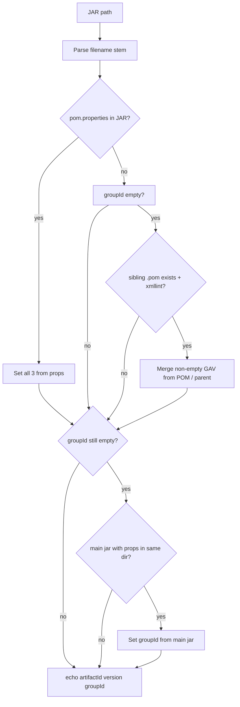

# `get_jar_metadata` resolution matrix

Reference for how `get_jar_metadata` in `package_utils.sh` resolves Maven coordinates.
Output format: `artifactId version groupId` (space-separated).

Resolution runs in **four stages** (each stage can override earlier values, with guards noted below):

```text
① Filename stem  →  ② pom.properties in JAR  →  ③ Sibling POM  →  ④ Main-jar groupId lookup
```

---

## Stage ① — Filename stem (always runs first)

| JAR filename pattern | Example                    | artifactId        | version           | Notes                                                           |
| -------------------- | -------------------------- | ----------------- | ----------------- | --------------------------------------------------------------- |
| No version segment   | `test.jar`                 | `test`            | `test`            | Whole stem used for both; weak parser                           |
| Standard GAV stem    | `my-app-1.0.0.jar`         | `my-app-1.0.0`    | `my-app-1.0.0`    | **Not split** — no `-version` extraction unless javadoc/sources |
| Child module stem    | `child-one-1.0.0.jar`      | `child-one-1.0.0` | `child-one-1.0.0` | Same; relies on later stages for real GAV                       |
| Javadoc classifier   | `my-app-1.0.0-javadoc.jar` | `my-app`          | `1.0.0`           | Only pattern filename parser handles well                       |
| Sources classifier   | `my-app-1.0.0-sources.jar` | `my-app`          | `1.0.0`           | Same as javadoc                                                 |

---

## Stage ② — `META-INF/maven/.../pom.properties` inside JAR

**Condition:** JAR contains a `pom.properties` entry  
**Effect:** Overwrites **all three** fields (`artifactId`, `version`, `groupId`)  
**Sibling POM stage skipped** when `groupId` is set here

| Layout             | Example                                        | artifactId  | version    | groupId              | Test / fixture                    |
| ------------------ | ---------------------------------------------- | ----------- | ---------- | -------------------- | --------------------------------- |
| Embedded coords    | `my-app-1.0.0.jar` + internal `pom.properties` | from props  | from props | from props           | `make_maven_jar_with_coords`      |
| Nested repo layout | `maven-repo/.../child-one-1.0.0.jar`           | `child-one` | `1.0.0`    | `com.example.parent` | `create_jfrog_maven_fixture_tree` |
| Flat, no props     | `test.jar` (zip only)                          | —           | —          | —                    | Falls through to stage ③          |

---

## Stage ③ — Sibling POM (`{stem}.pom` next to JAR)

**Conditions (all required):**

- `groupId` still empty after stages ①–②
- `{jar_dir}/{stem}.pom` exists
- `xmllint` available

**Effect:** Each field updated **only if POM supplies a non-empty value** (via `_maven_read_pom_gav` in `maven-helpers.sh`, with `<parent>` fallback for `groupId` / `version`)

| Sibling POM shape                  | Example files                     | artifactId                | version                 | groupId                              | Test                                                                                   |
| ---------------------------------- | --------------------------------- | ------------------------- | ----------------------- | ------------------------------------ | -------------------------------------------------------------------------------------- |
| Direct GAV on `<project>`          | `test.jar` + `test.pom`           | from POM                  | from POM                | from POM                             | `reads name, version and group from a sibling POM` → `my-app 2.1.0 com.example.direct` |
| Parent only (no child coords)      | `test.jar` + parent-only POM      | **keeps filename** `test` | from `<parent>` `1.0.0` | from `<parent>` `com.example.parent` | `keeps filename pkgname when sibling POM inherits all GAV from parent`                 |
| Child `artifactId` + inherited GAV | `child-one-1.0.0.jar` + child POM | from POM `child-one`      | from `<parent>` `1.0.0` | from `<parent>` `com.example.parent` | `resolves child module GAV…`                                                           |
| Inherited, no `artifactId`         | same as row 2                     | filename kept             | parent                  | parent                               | Guards prevent blank overwrite                                                         |
| Sibling missing                    | `foo.jar`, no `foo.pom`           | stage ① only              | stage ① only            | empty                                | —                                                                                      |
| `xmllint` absent                   | any + sibling POM                 | stage ① only              | stage ① only            | empty                                | stage ③ skipped entirely                                                               |

---

## Stage ④ — Main-jar `groupId` lookup (javadoc / sources)

**Conditions:**

- `groupId` still empty
- Current JAR is likely a classifier (`*-javadoc.jar` / `*-sources.jar`)
- Another JAR `{pkgname}-*.jar` in same dir (not javadoc/sources, not self)
- Main JAR has `pom.properties`

**Effect:** Sets **`groupId` only** (from main JAR's `pom.properties`)

| Scenario                | Example dir contents                           | artifactId        | version          | groupId             |
| ----------------------- | ---------------------------------------------- | ----------------- | ---------------- | ------------------- |
| Javadoc + main jar      | `my-app-1.0.0.jar`, `my-app-1.0.0-javadoc.jar` | `my-app` (from ①) | `1.0.0` (from ①) | from main jar props |
| Sources + main jar      | `my-app-1.0.0-sources.jar` + main              | `my-app`          | `1.0.0`          | from main jar props |
| Classifier, no main jar | `my-app-1.0.0-javadoc.jar` alone               | `my-app`          | `1.0.0`          | **empty**           |
| Main jar has no props   | main jar without `pom.properties`              | from ①            | from ①           | **empty**           |

---

## Combined scenarios (end-to-end)

| #   | Layout                                      | pom.properties | Sibling POM           | Expected output                      | Upload path (via `process_jar`)             |
| --- | ------------------------------------------- | -------------- | --------------------- | ------------------------------------ | ------------------------------------------- |
| 1   | Flat `test.jar` + `test.pom` (direct GAV)   | No             | Direct GAV            | `my-app 2.1.0 com.example.direct`    | `jar/com/example/direct/my-app/2.1.0/`      |
| 2   | Flat `test.jar` + parent-only POM           | No             | Parent only           | `test 1.0.0 com.example.parent`      | `jar/com/example/parent/test/1.0.0/`        |
| 3   | Flat `child-one-1.0.0.jar` + child POM      | No             | Parent + `artifactId` | `child-one 1.0.0 com.example.parent` | `jar/com/example/parent/child-one/1.0.0/`   |
| 4   | Nested `child-one-1.0.0.jar`                | **Yes**        | Yes (ignored)         | `child-one 1.0.0 com.example.parent` | props win; sibling skipped                  |
| 5   | `my-app-1.0.0-javadoc.jar` + main jar       | Main: yes      | Optional              | `my-app 1.0.0 {from main props}`     | stage ④ fills `groupId`                     |
| 6   | `my-app-1.0.0.jar` only, no POM             | No             | No                    | `my-app-1.0.0 my-app-1.0.0 ""`       | **No groupId** → generic fallback in upload |
| 7   | `test.jar` only                             | No             | No                    | `test test ""`                       | generic / wrong GAV                         |
| 8   | Flat `test.jar` + sibling POM, no `xmllint` | No             | Present               | `test test ""`                       | stage ③ skipped                             |

---

## Decision flow



---

## Test coverage map

| Variation                                | Covered by                                            |
| ---------------------------------------- | ----------------------------------------------------- |
| Direct sibling POM GAV                   | `test_metadata.bats` — reads name, version and group  |
| Parent-only sibling POM                  | `test_metadata.bats` — keeps filename pkgname…        |
| Child module + parent inheritance        | `test_metadata.bats` — resolves child module GAV…     |
| Embedded `pom.properties`                | `make_maven_jar_with_coords`, maven structuring tests |
| POM structuring (not `get_jar_metadata`) | `test_maven_structuring.bats` — detect_types paths    |
| Javadoc main-jar `groupId` lookup        | **No dedicated unit test**                            |
| Filename-only / no metadata              | **No dedicated unit test**                            |
| Missing `xmllint`                        | **No dedicated unit test**                            |

---

## Related code

| File                                             | Role                                                   |
| ------------------------------------------------ | ------------------------------------------------------ |
| `package_utils.sh` — `get_jar_metadata()`        | Orchestrates the four stages                           |
| `lib/maven-helpers.sh` — `_maven_read_pom_gav()` | Sibling POM parsing with parent fallback               |
| `tests/helpers/maven_fixtures.bash`              | `make_flat_jar_with_pom`, `make_maven_jar_with_coords` |
